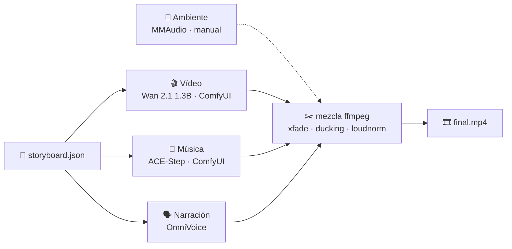

<div align="center">

# 🎬 Local AI Trailer Studio

**Haz el tráiler de una película corta —vídeo, música, narración y mezcla final— entero en tu propia GPU.**
**Construido y medido en una GPU de estación de trabajo de 6 GB (Quadro RTX 3000). Sin nube, sin claves de API.**

[🇬🇧 Read in English](README.md)


<sub>↑ El tráiler demo: 6 clips de Wan 2.1 · música de ACE-Step · narración de OmniVoice · mezclado con ffmpeg.<br>
Calidad completa: <a href="output/TEASER_FINAL_completo.mp4"><code>output/TEASER_FINAL_completo.mp4</code></a></sub>

</div>

---

## Qué es esto

ComfyUI hace vídeo. ACE-Step hace música. OmniVoice hace voces. ffmpeg mezcla. **Todos son geniales y cada uno
tiene su propio repo — este proyecto no es ninguno de ellos.**

Este repo es el **pegamento y las notas de campo** para que trabajen *juntos* en una GPU pequeña:

- 🧩 **`trailer.py`** — un orquestador de un solo archivo (solo librería estándar) que convierte un
  `storyboard.json` en un tráiler terminado, etapa por etapa y de forma idempotente.
- 🐳 **Setup Docker** de ComfyUI y OmniVoice que cabe en **6 GB de VRAM**, incluido lo que muerde a todo el mundo:
  *ambos servicios quieren la única GPU* (el script se la pasa de uno a otro por ti).
- 📏 **Resultados medidos**, no supuestos: qué cabe, qué no, qué se ve bien y qué hace perder horas.
- 🤖 **Un contrato para orquestación con LLM**: dale a Claude / GPT / cualquier agente con acceso a shell el
  encargo y deja que dirija toda la producción.

## La pipeline



| Etapa | Herramienta | Comando | Tiempo de referencia (RTX 3000, 6 GB) |
|---|---|---|---|
| 🎬 Vídeo | Wan 2.1 T2V 1.3B | `trailer.py video` | ~24 min por clip de 5 s (6 min en `--preview`) |
| 🎵 Música | ACE-Step 3.5B | `trailer.py music` | ~1.5 min para 28 s |
| 🗣️ Voz | OmniVoice (español y más) | `trailer.py voice` | ~2 min por frase |
| ✂️ Mezcla | ffmpeg | `trailer.py mix` | segundos |

> ⚠️ **Una GPU, dos servicios.** ComfyUI y OmniVoice no pueden ocupar 6 GB a la vez. `trailer.py voice` para
> ComfyUI, ejecuta OmniVoice y vuelve a arrancar ComfyUI. ¿Prefieres gestionarlo tú? `--no-gpu-switch`.

## Inicio rápido

```bash
git clone https://github.com/balalex12/trailer-studio-local.git && cd trailer-studio-local

# 1. custom nodes (no van en el repo)
git clone https://github.com/city96/ComfyUI-GGUF                  custom_nodes/ComfyUI-GGUF
git clone https://github.com/Kosinkadink/ComfyUI-VideoHelperSuite custom_nodes/ComfyUI-VideoHelperSuite

# 2. modelos (~14 GB, +5 GB si añades MMAudio) → URLs y carpetas en docs/SETUP.es.md
# 3. arrancar ComfyUI (Docker Desktop con soporte GPU NVIDIA)
docker compose up -d --build            # http://localhost:8188

# 4. comprobar que todo está en su sitio y ver el plan
python trailer.py doctor
python trailer.py plan examples/ghibli_teaser.json

# 5. iterar rápido y luego calidad final
python trailer.py video examples/ghibli_teaser.json --preview --scene s01
python trailer.py run   examples/ghibli_teaser.json
```

Los resultados quedan en `output/projects/<nombre>/`. Relanzar un comando **continúa donde se quedó**: los clips,
la música y las voces que ya existen se saltan (`--force` para rehacerlos).

## El storyboard

Un JSON describe todo el tráiler ([ejemplo completo](examples/ghibli_teaser.json)):

```jsonc
{
  "name": "ghibli_teaser",
  "style":  { "prompt_prefix": "Hand-drawn 2D anime animation…", "negative": "photorealistic, 3d render…" },
  "scenes": [
    { "id": "s01", "prompt": "Dawn over a wide green valley. Thin mist drifts slowly between hills…" },
    { "id": "s02", "prompt": "A meadow of tall grass sways continuously in a strong breeze…" }
  ],
  "music":     { "tags": "studio ghibli, orchestral, gentle piano, strings, flute", "seconds": 28 },
  "narration": { "language": "es", "lines": [ { "start": 2.0, "text": "Hay lugares que solo existen…" } ] },
  "mix":       { "crossfade": 0.5 }
}
```


<sub>Las seis escenas de la demo — un clip de 5 s cada una.</sub>

## Tres formas de manejarlo

| | Tú | Ideal para |
|---|---|---|
| **1. A mano** | Abres ComfyUI, cargas un workflow de [`workflows/`](workflows/), usas la UI/API de OmniVoice y mezclas con ffmpeg. | Aprender, control fino. Ver el [manual](MANUAL.md). |
| **2. Script** | Escribes un storyboard y ejecutas `trailer.py`. | Ejecuciones repetibles, lotes, renders nocturnos. |
| **3. Orquestador LLM** | Le dices a un agente *"haz un tráiler de 30 s sobre X"*. Él escribe el storyboard, lanza las etapas, revisa los resultados y rehace lo flojo. | Dirección sin manos. → **[docs/ORCHESTRATION.es.md](docs/ORCHESTRATION.es.md)** |

El orquestador es *solo un usuario del CLI*: cada etapa es un comando de shell con códigos de salida claros y
`trailer.py status --json` para el estado. Cualquier modelo que pueda ejecutar comandos puede manejarlo — en los
docs hay un prompt de sistema listo para copiar.

## Lo que medí en 6 GB

- **Wan 2.1 1.3B es el punto óptimo**: el mayor modelo de vídeo que cabe *entero* en VRAM → ~24 min/clip.
- **El 14B no cabe**: con streaming desde RAM, un clip de 5 s tardó **más de 2 h sin terminar**. No lo hagas.
- **El LoRA de velocidad CausVid empeora el realismo.** Perfecto para previews (~6 min), no para el render final.
- **30 pasos ≫ 15 pasos** — pero solo se nota *en movimiento*. Juzga el vídeo mirando vídeo, nunca fotogramas.
- **Prompts fotográficos y mundanos dan realismo** ("50 mm f2.8, documentary"); lo épico empuja a ilustración.
- **Describe el movimiento explícitamente** o saldrá un clip casi congelado.
- **OmniVoice se cuelga en CPU** — solo GPU.
- **MMAudio**: nunca más de 15 s de audio de una vez en 6 GB.

Tablas completas y la historia detrás: [docs/SETUP.es.md](docs/SETUP.es.md).

## Estado, con honestidad

- ✅ **Probado**: manejo del storyboard, el grafo de Wan (construido para coincidir nodo a nodo con los workflows
  incluidos), el flujo HTTP contra un ComfyUI simulado y toda la mezcla con ffmpeg (crossfades, ducking,
  loudness) sobre medios reales.
- ⚠️ **Aún no ejecutado de punta a punta en una GPU real**: el proyecto se desmontó (modelos borrados) antes de
  escribir el orquestador. El grafo de ACE-Step sigue el ejemplo oficial de ComfyUI. **`trailer.py doctor` valida
  cada nodo, nombre de input y archivo de modelo contra tu ComfyUI en vivo** antes de que gastes horas — si algo
  cambió, te dice exactamente qué. Issues y PRs bienvenidos.
- 🍃 **El ambiente (MMAudio) es manual**: genéralo en ComfyUI y apunta `ambience.file` al resultado.
- 🐢 **Esto no es rápido.** ~2.5 h de GPU para la demo de 28 s. Es un laboratorio para GPUs pequeñas, no una
  línea de producción. Con 24 GB querrás modelos mayores — la estructura sigue valiendo.

## Estructura del repo

```
trailer.py            CLI orquestador (doctor · plan · video · music · voice · mix · status · run)
examples/             storyboards para copiar
workflows/            workflows de ComfyUI para uso manual (final / preview / anime)
docker-compose.yml    ComfyUI (--lowvram)          dockerfile · entrypoint.sh
omnivoice/            OmniVoice TTS, contenedor aparte
docs/                 ORCHESTRATION · SETUP.es · img/
MANUAL.md             uso manual de ComfyUI, prompts, audio
LICENSE               MIT (solo código y docs — ver Licencias)
```

## Licencias y créditos

El código y la documentación de este repo son **MIT** ([LICENSE](LICENSE)). Los modelos **no** están incluidos:
los descargas de sus autores y **cada uno tiene su propia licencia**. Comprobado contra las páginas originales en
octubre de 2026; vuelve a verificarlo antes de apoyarte en ello.

| Componente | Rol | Licencia | ¿Uso comercial del resultado? |
|---|---|---|---|
| [Wan 2.1 T2V 1.3B](https://huggingface.co/Wan-AI/Wan2.1-T2V-1.3B) | vídeo | Apache 2.0 | ✅ Sí — los autores no reclaman derechos sobre lo generado |
| [ACE-Step v1 3.5B](https://huggingface.co/ACE-Step/ACE-Step-v1-3.5B) | música | Apache 2.0 | ✅ Sí — pero la ficha del modelo pide declarar el uso de IA, verificar originalidad y no generar material con copyright |
| [MMAudio](https://github.com/hkchengrex/MMAudio) | ambiente | código MIT · **pesos CC-BY-NC 4.0** | ❌ **No comercial** |
| [OmniVoice](https://huggingface.co/k2-fsa/OmniVoice) | narración | código Apache 2.0 · **modelo CC-BY-NC** | ❌ **No comercial.** Además prohíbe la clonación de voz sin autorización y la suplantación |

> **En la práctica:** un tráiler con solo Wan + ACE-Step (vídeo + música) es válido comercialmente. Si añades la
> narración de OmniVoice o el ambiente de MMAudio, trata el resultado como **no comercial** (la lectura prudente
> de CC-BY-NC). La demo de este repo lleva narración de OmniVoice, así que es una demo no comercial.

Herramientas usadas pero **no incluidas ni modificadas** aquí:

| Herramienta | Licencia |
|---|---|
| [ComfyUI](https://github.com/comfyanonymous/ComfyUI) | GPL-3.0 |
| [ComfyUI-VideoHelperSuite](https://github.com/Kosinkadink/ComfyUI-VideoHelperSuite) | GPL-3.0 |
| [ComfyUI-GGUF](https://github.com/city96/ComfyUI-GGUF) | Apache 2.0 |
| [ComfyUI-MMAudio](https://github.com/kijai/ComfyUI-MMAudio) | MIT (código; pesos, ver arriba) |
| [VoiceStudio / OmniVoice Studio](https://github.com/debpalash/VoiceStudio) (imagen `ghcr.io/debpalash/omnivoice-studio`) | AGPL-3.0; indica que los modelos que descarga tienen sus propias licencias |

Este repo solo *configura y llama* a estas herramientas (compose de Docker, workflows, llamadas HTTP); no
redistribuye su código ni sus pesos.

Usa con responsabilidad las voces y semejanzas generadas: no suplantes a personas reales y etiqueta el contenido
generado con IA.
