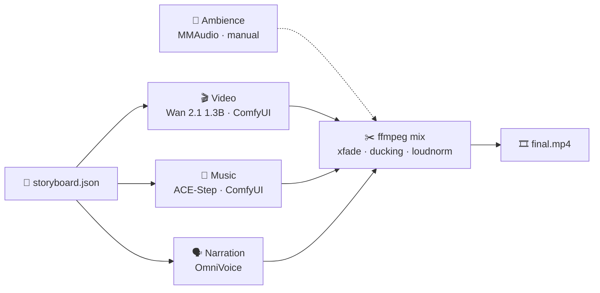

<div align="center">

# 🎬 Local AI Trailer Studio

**Make a short film trailer (video, music, narration and final mix) entirely on your own GPU.**
**Built and measured on a 6 GB workstation GPU (Quadro RTX 3000). No cloud, no API keys.**

[🇪🇸 Leer en español](README.es.md)


<sub>↑ The demo trailer: 6 clips of Wan 2.1 · music by ACE-Step · narration by OmniVoice · mixed with ffmpeg.<br>
Full quality: <a href="output/TEASER_FINAL_completo.mp4"><code>output/TEASER_FINAL_completo.mp4</code></a></sub>

</div>

---

## What this is

ComfyUI makes video. ACE-Step makes music. OmniVoice makes voices. ffmpeg mixes. **They're all great and they all
have their own repos; this project is none of them.**

This repo is the **glue and the field notes** for making them work *together* on a small GPU:

- 🧩 **`trailer.py`**, a single-file orchestrator (stdlib only) that turns a `storyboard.json` into a finished
  trailer, one idempotent stage at a time.
- 🐳 **Docker setup** for ComfyUI and OmniVoice that fits in **6 GB of VRAM**, including the one thing that bites
  everybody: *both services want the only GPU* (the script hands it back and forth for you).
- 📏 **Measured results**, not guesses: what fits, what doesn't, what looks good, what wastes hours.
- 🤖 **A contract for LLM orchestration**: give a Claude / GPT / any agent with shell access the storyboard job
  and let it direct the whole production.

## The pipeline



| Stage | Tool | Command | Reference time (RTX 3000, 6 GB) |
|---|---|---|---|
| 🎬 Video | Wan 2.1 T2V 1.3B | `trailer.py video` | ~24 min / 5 s clip (6 min in `--preview`) |
| 🎵 Music | ACE-Step 3.5B | `trailer.py music` | ~1.5 min for 28 s |
| 🗣️ Voice | OmniVoice (Spanish & more) | `trailer.py voice` | ~2 min / sentence |
| ✂️ Mix | ffmpeg | `trailer.py mix` | seconds |

> ⚠️ **One GPU, two services.** ComfyUI and OmniVoice can't hold 6 GB at the same time. `trailer.py voice` stops
> ComfyUI, runs OmniVoice, then starts ComfyUI again. Don't want that? `--no-gpu-switch`.

## Quick start

```bash
git clone https://github.com/balalex12/trailer-studio-local.git && cd trailer-studio-local

# 1. custom nodes (not in the repo)
git clone https://github.com/city96/ComfyUI-GGUF                  custom_nodes/ComfyUI-GGUF
git clone https://github.com/Kosinkadink/ComfyUI-VideoHelperSuite custom_nodes/ComfyUI-VideoHelperSuite

# 2. models (~14 GB, +5 GB if you add MMAudio) → URLs and folders in docs/SETUP.es.md
# 3. start ComfyUI (Docker Desktop with NVIDIA GPU support)
docker compose up -d --build            # http://localhost:8188

# 4. check everything is in place, then see the plan
python trailer.py doctor
python trailer.py plan examples/ghibli_teaser.json

# 5. iterate fast, then go for quality
python trailer.py video examples/ghibli_teaser.json --preview --scene s01
python trailer.py run   examples/ghibli_teaser.json
```

Outputs land in `output/projects/<name>/`. Re-running a command **continues where it left off**: existing clips,
music and voice files are skipped (`--force` to redo).

## The storyboard

One JSON file describes the whole trailer ([full example](examples/ghibli_teaser.json)):

```jsonc
{
  "name": "ghibli_teaser",
  "style":  { "prompt_prefix": "Hand-drawn 2D anime animation…", "negative": "photorealistic, 3d render…" },
  "scenes": [
    { "id": "s01", "prompt": "Dawn over a wide green valley. Thin mist drifts slowly between hills…" },
    { "id": "s02", "prompt": "A meadow of tall grass sways continuously in a strong breeze…" }
  ],
  "music":     { "tags": "studio ghibli, orchestral, gentle piano, strings, flute", "seconds": 28 },
  "narration": { "language": "es", "lines": [ { "start": 2.0, "text": "Hay lugares que solo existen…" } ] },
  "mix":       { "crossfade": 0.5 }
}
```


<sub>The six scenes of the demo, one 5 s clip each.</sub>

## Three ways to drive it

| | You | Best for |
|---|---|---|
| **1. By hand** | Open ComfyUI, load a workflow from [`workflows/`](workflows/), call OmniVoice's UI/API, mix with ffmpeg. | Learning, fine control. See the [manual](MANUAL.md) *(Spanish)*. |
| **2. Script** | Write a storyboard, run `trailer.py`. | Repeatable runs, batches, overnight renders. |
| **3. LLM orchestrator** | Tell an agent *"make a 30 s trailer about X"*. It writes the storyboard, runs the stages, looks at the results, redoes what's weak. | Hands-off direction. → **[docs/ORCHESTRATION.md](docs/ORCHESTRATION.md)** |

The orchestrator is *just a user of the CLI*: every stage is a shell command with clear exit codes and
`trailer.py status --json` for state. Any model that can run commands can drive it; there's a copy-paste
system prompt in the docs.

## What I measured on 6 GB

- **Wan 2.1 1.3B is the sweet spot**: the largest video model that fits *entirely* in VRAM → ~24 min/clip.
- **The 14B does not fit**: streaming from RAM took **2 h without finishing** one 5 s clip. Don't.
- **The CausVid speed-up LoRA hurts realism.** Great for previews (~6 min), not for final renders.
- **30 steps ≫ 15 steps**, but only visible *in motion*. Judge video by watching video, never single frames.
- **Photographic, mundane prompts give realism** ("50 mm f2.8, documentary"); epic words push towards illustration.
- **Describe the motion explicitly** or you get a near-frozen clip.
- **OmniVoice hangs on CPU**, GPU only.
- **MMAudio**: never >15 s of audio at once on 6 GB.

Full tables and the story behind them: [docs/SETUP.es.md](docs/SETUP.es.md) *(Spanish)*.

## Status

- ✅ **Built and measured on real hardware**: Wan, ACE-Step, OmniVoice and the ffmpeg mix were all run on a 6 GB
  GPU while making the demo, and the numbers in this README come from those runs.
- 🧩 **`trailer.py` is a thin layer over those same workflows.** Its Wan graph matches the shipped workflows node
  by node, and **`trailer.py doctor` validates every node, input name and model filename against your live
  ComfyUI** before you start a long render. If something drifted, it tells you exactly what. Issues and PRs welcome.
- 🍃 **Ambience (MMAudio) is manual**: generate it in ComfyUI and point `ambience.file` at the result.
- 🐢 **This is not fast.** ~2.5 h of GPU for the 28 s demo. It's a laboratory for small GPUs, not a production
  line. With 24 GB you'll want bigger models, and the structure still applies.

## Repo layout

```
trailer.py            orchestrator CLI (doctor · plan · video · music · voice · mix · status · run)
examples/             storyboards to copy from
workflows/            ComfyUI workflows for manual use (final / preview / anime)
docker-compose.yml    ComfyUI (--lowvram)          dockerfile · entrypoint.sh
omnivoice/            OmniVoice TTS, separate container
docs/                 ORCHESTRATION · SETUP.es · img/
MANUAL.md             manual use of ComfyUI, prompts, audio (Spanish)
LICENSE               MIT (code and docs only, see Licenses)
```

## Licenses & credits

The code and docs in this repo are **MIT** ([LICENSE](LICENSE)). The models are **not** included; you download
them from their authors, and **each one has its own license**. Checked against the upstream pages in October 2026;
verify again before relying on it.

| Component | Role | License | Commercial use of the output? |
|---|---|---|---|
| [Wan 2.1 T2V 1.3B](https://huggingface.co/Wan-AI/Wan2.1-T2V-1.3B) | video | Apache 2.0 | ✅ Yes, the authors claim no rights over generated content |
| [ACE-Step v1 3.5B](https://huggingface.co/ACE-Step/ACE-Step-v1-3.5B) | music | Apache 2.0 | ✅ Yes, but the model card asks you to disclose AI involvement, verify originality and not generate copyrighted material |
| [MMAudio](https://github.com/hkchengrex/MMAudio) | ambience | code MIT · **weights CC-BY-NC 4.0** | ❌ **Non-commercial** |
| [OmniVoice](https://huggingface.co/k2-fsa/OmniVoice) | narration | code Apache 2.0 · **model CC-BY-NC** | ❌ **Non-commercial.** Also forbids unauthorized voice cloning and impersonation |

> **In practice:** a trailer using only Wan + ACE-Step (video + music) is fine commercially. Add the OmniVoice
> narration or MMAudio ambience and treat the result as **non-commercial** (the conservative reading of CC-BY-NC).
> The demo in this repo includes OmniVoice narration, so it is a non-commercial demo.

Tools used but **not bundled or modified** here:

| Tool | License |
|---|---|
| [ComfyUI](https://github.com/comfyanonymous/ComfyUI) | GPL-3.0 |
| [ComfyUI-VideoHelperSuite](https://github.com/Kosinkadink/ComfyUI-VideoHelperSuite) | GPL-3.0 |
| [ComfyUI-GGUF](https://github.com/city96/ComfyUI-GGUF) | Apache 2.0 |
| [ComfyUI-MMAudio](https://github.com/kijai/ComfyUI-MMAudio) | MIT (code; weights see above) |
| [VoiceStudio / OmniVoice Studio](https://github.com/debpalash/VoiceStudio) (container image `ghcr.io/debpalash/omnivoice-studio`) | AGPL-3.0; states that the models it downloads have their own licenses |

This repo only *configures and calls* them (Docker compose files, workflows, HTTP calls), it doesn't redistribute
their code or weights.

Please use generated voices and likenesses responsibly: don't impersonate real people, and label AI-generated media.
